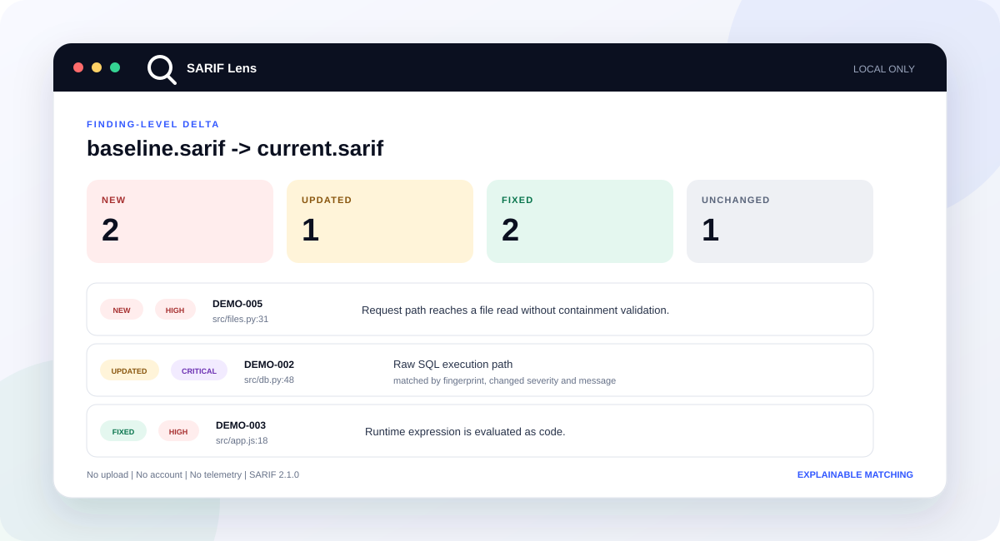

<p align="center">
  
</p>

<h1 align="center">SARIF Lens</h1>

<p align="center"><strong>Compare SARIF findings across runs, locally.</strong></p>

<p align="center">
  <a href="https://github.com/VirtualSpaceGit/sarif-lens/actions/workflows/ci.yml"></a>
  <a href="LICENSE"></a>
  <a href="package.json"></a>
  
</p>

<p align="center">
  
</p>

Static-analysis reports are good at showing what exists in one run. During review, the harder question is whether a particular finding is new, moved, changed, or fixed.

SARIF Lens matches finding instances across two SARIF 2.1.0 reports, then classifies each result as new, updated, fixed, or unchanged. The same deterministic engine powers an offline browser workbench, a zero-runtime-dependency Node CLI, and a GitHub Action policy gate.

No account. No upload. No telemetry.

This is an early release. The core diff and gate are usable now, but producer-specific fingerprints and path normalization still have edge cases. If a report does not match as expected, open an issue with a small synthetic fixture.

## Quick start

Run the offline workbench locally:

```bash
git clone https://github.com/VirtualSpaceGit/sarif-lens.git
cd sarif-lens
npm run serve
```

Load the included example in the browser, or compare it from the terminal:

```bash
npx --yes github:VirtualSpaceGit/sarif-lens diff examples/baseline.sarif examples/current.sarif
```

```text
SARIF Lens diff
examples/baseline.sarif  ->  examples/current.sarif
New 2  Updated 1  Fixed 2  Unchanged 1

+ HIGH     DEMO-005
  src/files.py:31  A request path reaches a file read without containment validation.
+ LOW      DEMO-006
  src/cache.py:14  A legacy hash is used for an integrity decision.
~ CRITICAL DEMO-002
  src/db.py:48  Untrusted request data reaches a raw SQL execution path.
  changed: severity, message
```

Maintained by [Verse](https://virtualspacesec.com), creator of VirtualSpace AppSec. SARIF Lens accepts SARIF 2.1.0 from conforming scanners and does not require VirtualSpace AppSec.

For a quick terminal rendering of one report, see [sarif-pretty](https://github.com/VirtualSpaceGit/sarif-pretty). SARIF Lens focuses on baseline comparison, explainable matching, browser review, and CI policy gates.

## What it does

- Inspects a SARIF report without uploading source or findings
- Compares baseline and current reports at finding-instance level
- Handles line movement without treating the line number as primary identity
- Refuses ambiguous fingerprint collisions instead of guessing
- Explains the matching strategy and meaningful changes for every paired result
- Creates compact, reviewable baseline snapshots
- Exports terminal, Markdown, JSON, CSV, and annotated SARIF output
- Enforces a versioned JSON policy with stable exit codes
- Runs the same comparison engine in the browser, CLI, and GitHub Action

## Commands

```text
sarif-lens inspect CURRENT [options]
sarif-lens baseline CURRENT -o baseline.json
sarif-lens diff BASELINE CURRENT [options]
sarif-lens gate BASELINE CURRENT --policy policy.json [options]
```

Examples:

```bash
# Inspect one report
npx --yes github:VirtualSpaceGit/sarif-lens inspect results.sarif

# Save a compact baseline for the next build
npx --yes github:VirtualSpaceGit/sarif-lens baseline results.sarif -o .sarif-lens-baseline.json

# Export only new and updated findings
npx --yes github:VirtualSpaceGit/sarif-lens diff old.sarif new.sarif \
  --state new,updated \
  --format markdown \
  --output security-delta.md

# Normalize a changing checkout prefix before matching
npx --yes github:VirtualSpaceGit/sarif-lens diff old.sarif new.sarif \
  --strip-prefix /home/runner/work/project

# Fail when a new high or critical result appears
npx --yes github:VirtualSpaceGit/sarif-lens gate old.sarif new.sarif --fail-on high
```

Exit codes are stable for CI:

| Code | Meaning |
| ---: | --- |
| 0 | Command succeeded or gate passed |
| 1 | Policy gate failed |
| 2 | Input, arguments, or policy are invalid |
| 3 | Unexpected internal failure |

The browser accepts files up to 50 MiB. The CLI accepts files up to 100 MiB.

## Matching you can audit

SARIF Lens first pairs runs, then matches results one to one. It tries stronger producer evidence before deterministic fallbacks:

| Order | Result signal | Confidence |
| ---: | --- | --- |
| 1 | `correlationGuid` | Exact |
| 2 | Common final fingerprint | Exact |
| 3 | Common partial fingerprint | High |
| 4 | Normalized source snippet and path | High |
| 5 | Normalized message and path | Medium |
| 6 | Path and line compatibility fallback | Low |

Tool identity and rule ID scope every key. A line number is never the primary identity. When one key points to multiple candidates, SARIF Lens keeps the findings separate and emits a matching note.

If producer correlation or fingerprint data exists but conflicts, SARIF Lens does not fall back to message or location similarity.

See [the matching model](docs/matching.md) for run pairing, update semantics, collision handling, and limitations.

## Policy gates

Start with [`examples/policy.json`](examples/policy.json):

```json
{
  "version": 1,
  "failOn": "high",
  "maxNew": 5,
  "maxNewBySeverity": {
    "critical": 0
  },
  "includeUpdated": false,
  "includeSuppressed": false,
  "denyRules": ["dangerous-eval"],
  "ignore": [
    {
      "rule": "legacy-*",
      "path": "vendor/**",
      "reason": "Third-party source",
      "expires": "2026-12-31"
    }
  ]
}
```

Policy files are data only. SARIF Lens never executes policy code. Expired ignores stop applying and produce a warning.

Read [the policy reference](docs/policy.md) for matching fields and evaluation rules.

## GitHub Actions

```yaml
name: SARIF delta

on:
  pull_request:

jobs:
  gate:
    runs-on: ubuntu-latest
    steps:
      - uses: actions/checkout@v7
      - name: Run your scanner
        run: your-scanner --sarif current.sarif
      - uses: VirtualSpaceGit/sarif-lens@v0.1.1
        with:
          baseline: .security/baseline.sarif
          current: current.sarif
          policy: .sarif-lens.json
```

The action writes a Markdown job summary and exposes `passed`, `new`, `updated`, `fixed`, and `report` outputs. See [the CI guide](docs/ci.md).

## Local privacy and hostile input

The browser workbench uses no runtime CDN, remote font, analytics, account, or report upload. Its Content Security Policy blocks network connections. Files are parsed in a Web Worker, kept in memory, and are not stored in `localStorage` or IndexedDB.

Every SARIF field is treated as untrusted text. The UI creates DOM nodes with `textContent`, CSV values are neutralized against spreadsheet formulas, and artifact URIs are displayed without being fetched or opened automatically.

The hosted page itself must be downloaded like any website. After it loads, report processing stays in the browser. For a fully disconnected environment, clone the repository and use `npm run serve`.

Read [the security model](docs/security-model.md) and report vulnerabilities through [SECURITY.md](SECURITY.md).

## Compatibility and scope

SARIF Lens consumes SARIF 2.1.0 JSON and SARIF Lens compact baselines. The parser is scanner-neutral, but real producers sometimes use paths and fingerprints differently. Compatibility work is tracked through synthetic fixtures rather than private scan data.

Version 0.1 deliberately does not:

- Run scanners
- Fetch source files or artifact URIs
- Upload reports to a service
- Edit suppressions
- Guess fuzzy matches below its documented fallback rules
- Claim full JSON Schema validation
- Replace a vulnerability management platform

Structural checks are tolerant so real-world logs remain inspectable. Strict schema conformance and producer fixture expansion are tracked in the roadmap.

## Library API

The core is available through the package root:

```js
import { diffAnalyses, loadAnalysis } from "sarif-lens";

co…40 tokens truncated…onst delta = diffAnalyses(baseline, current);

console.log(delta.summary);
```

The normalized analysis, diff, compact baseline, and policy result objects are deterministic JSON data.

## Development

Requirements: Node 22 or newer. There are no runtime dependencies.

```bash
npm test
npm run lint
npm run check
npm run benchmark
```

`npm run check` runs source checks, tests, and an npm package dry run. `npm run benchmark` verifies a synthetic 25,000-result comparison without applying a machine-specific time threshold. CI tests Node 22, 24, and 26.

Contributions are welcome. Start with [CONTRIBUTING.md](CONTRIBUTING.md), the [roadmap](ROADMAP.md), or a fixture that represents a producer edge case without including private scan data.

## License

MIT. See [LICENSE](LICENSE).
